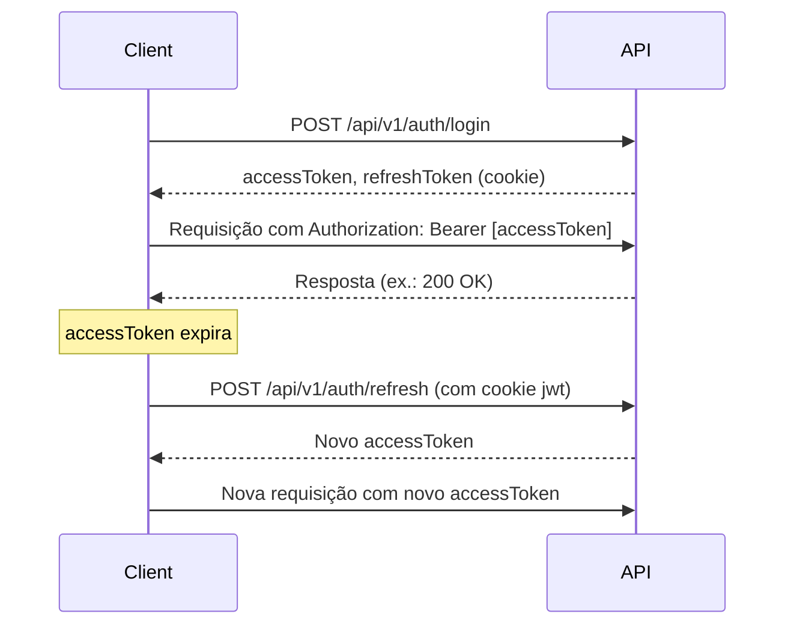

# QOTA - API Documentação (MVP 1) 🚀

   

O **QOTA** é uma plataforma SaaS para gestão de bens compartilhados (imóveis, veículos, embarcações, aeronaves) em sistemas de cotas. Desenvolvido como Trabalho de Conclusão de Curso (TCC) de Engenharia de Software, o projeto resolve desafios como conflitos financeiros e subutilização de ativos, com módulos integrados de gestão financeira, agendamento e controle de inventário. Este documento detalha a API do **MVP 1**, projetada para validação inicial com usuários.

---

## 📋 Sumário

- [Introdução](#introdução)
  - [Funcionalidades do MVP 1](#funcionalidades-do-mvp-1)
  - [Tecnologias Utilizadas](#tecnologias-utilizadas)
- [Primeiros Passos](#primeiros-passos)
- [Pré-requisitos](#pré-requisitos)
- [Configuração do Ambiente](#configuração-do-ambiente)
- [Estrutura do Projeto](#estrutura-do-projeto)
- [Estrutura do Banco de Dados](#estrutura-do-banco-de-dados)
- [Autenticação](#autenticação)
- [Parâmetros de Consulta](#parâmetros-de-consulta)
- [Lista de Endpoints](#lista-de-endpoints)
- [Endpoints Detalhados](#endpoints-detalhados)
  - [Autenticação](#autenticação-1)
  - [Usuários](#usuários)
  - [Propriedades](#propriedades)
  - [Permissões](#permissões)
  - [Documentos da Propriedade](#documentos-da-propriedade)
  - [Fotos da Propriedade](#fotos-da-propriedade)
- [Exemplos de Uso](#exemplos-de-uso)
- [Erros Comuns](#erros-comuns)
- [Logs](#logs)
- [Testes](#testes)
- [Docker e Deploy](#docker-e-deploy)
- [Sugestões de Melhorias](#sugestões-de-melhorias)
- [FAQs](#faqs)
- [Contribuição](#contribuição)
- [Licença](#licença)

---

## 📖 Introdução

O **QOTA** é uma solução inovadora para gestão de ativos compartilhados, permitindo que múltiplos proprietários gerenciem bens de forma eficiente e transparente. A API do MVP 1 implementa as funcionalidades iniciais do sistema, focando em autenticação, gerenciamento de usuários, propriedades, permissões e uploads de documentos e fotos.

### Funcionalidades do MVP 1
- 🔒 **Autenticação**: Registro, login, logout e renovação de tokens JWT.
- 👥 **Usuários**: Listagem, consulta, atualização e exclusão (soft delete).
- 🏡 **Propriedades**: Criação, consulta, atualização e exclusão (soft delete).
- 🔐 **Permissões**: Vinculação de usuários a propriedades com roles específicas.
- 📄 **Documentos**: Upload e gerenciamento de documentos (ex.: IPTU, matrícula).
- 📸 **Fotos**: Upload e gerenciamento de fotos de propriedades.

### Tecnologias Utilizadas
- **Backend**: Node.js, Express, TypeScript
- **Banco de Dados**: SQLite (desenvolvimento, PostgreSQL planejado para produção)
- **ORM**: Prisma
- **Autenticação**: JSON Web Token (JWT)
- **Validação**: Zod
- **Upload de Arquivos**: Multer
- **Bibliotecas**: bcrypt, jsonwebtoken, date-fns, uuid, cors, cookie-parser
- **Ferramentas**: Jest (futuro), ESLint, Prettier, Nodemon

---

## 🚀 Primeiros Passos

Para começar a usar a API localmente, siga este guia:

1. **Clone o repositório**:
   ```bash
   git clone [URL do repositório]
   cd qota-backend
   ```

2. **Instale as dependências**:
   ```bash
   npm install
   ```

3. **Configure o arquivo `.env`** (veja detalhes na seção [Configuração do Ambiente](#configuração-do-ambiente)).

4. **Execute as migrações do banco**:
   ```bash
   npm run migrate
   ```

5. **Inicie o servidor**:
   ```bash
   npm run dev
   ```

6. **Teste a API**:
   - Use o Postman para enviar uma requisição `POST` para `http://localhost:8001/api/v1/auth/register`.
   - Exemplo:
     ```bash
     curl -X POST http://localhost:8001/api/v1/auth/register \
     -H "Content-Type: application/json" \
     -d '{"email":"joao.silva@example.com","password":"senha123","nomeCompleto":"João da Silva","cpf":"12345678901","telefone":"11987654321"}'
     ```

---

## 🛠️ Pré-requisitos

- **Node.js**: v18.x ou superior
- **npm**: v8.x ou superior
- **SQLite**: Para desenvolvimento local
- **Postman**: Ou outra ferramenta para testar endpoints
- **Git**: Para clonar o repositório

---

## ⚙️ Configuração do Ambiente

### 1. Clonar o Repositório
```bash
git clone [URL do repositório]
cd qota-backend
```

### 2. Instalar Dependências
```bash
npm install
```

### 3. Configurar Variáveis de Ambiente
Crie um arquivo `.env` na raiz do projeto:

```env
# Porta do servidor
PORT=8001

# Origens permitidas (CORS)
ALLOWED_ORIGINS=http://localhost:8001,http://localhost:3000

# URL do frontend
FRONTEND_URL=http://localhost:3000

# Ambiente
NODE_ENV=development

# Segredos JWT
ACCESS_TOKEN_SECRET=sua_chave_secreta_aqui_1234567890
REFRESH_TOKEN_SECRET=outra_chave_secreta_aqui_0987654321

# Banco de dados
DATABASE_URL=file:./prisma/dev.db

# Logs
LOGS_DIR=./src/logs
```

⚠️ **Nota**: Substitua `sua_chave_secreta_aqui_1234567890` e `outra_chave_secreta_aqui_0987654321` por chaves seguras (ex.: geradas com `crypto.randomBytes(32).toString('hex')`).

### 4. Configurar o Banco de Dados
Execute as migrações do Prisma:
```bash
npm run migrate
```

Visualize o banco com Prisma Studio:
```bash
npm run studio
```

### 5. Configurar TypeScript
O `tsconfig.json` define as configurações:

```json
{
  "compilerOptions": {
    "module": "NodeNext",
    "moduleResolution": "NodeNext",
    "target": "ES2020",
    "sourceMap": true,
    "removeComments": true,
    "outDir": "dist"
  },
  "include": ["src/**/*"],
  "exclude": ["node_modules", "dist", "**/*.test.ts", "**/*.mock.ts"]
}
```

### 6. Rodar a API
```bash
npm run dev
```

A API estará disponível em `http://localhost:8001`.

### 7. Build para Produção
```bash
npm run build
npm start
```

---

## 📂 Estrutura do Projeto

```
├── prisma/
│   ├── migrations/              # Migrações do Prisma
│   ├── schema.prisma           # Esquema do banco
├── src/
│   ├── config/                 # Configurações
│   │   ├── allowedOrigins.ts
│   │   ├── corsOptions.ts
│   │   └── rolesList.ts
│   ├── controllers/            # Lógica de negócios
│   │   ├── Auth/
│   │   ├── User/
│   │   ├── Permission/
│   │   ├── Property/
│   │   ├── PropertyDocuments/
│   │   ├── PropertyPhoto/
│   ├── middleware/             # Middlewares
│   │   ├── credentials.ts
│   │   ├── errorHandler.ts
│   │   ├── logEvents.ts
│   │   ├── verifyJWT.ts
│   │   └── verifyRoles.ts
│   ├── routes/                 # Rotas
│   │   ├── auth.route.ts
│   │   ├── user.route.ts
│   │   ├── permission.route.ts
│   │   ├── property.route.ts
│   │   ├── propertyDocuments.route.ts
│   │   ├── propertyPhoto.route.ts
│   │   └── routes.ts
│   ├── utils/                  # Utilitários
│   │   └── prisma.ts
│   ├── server.ts               # Servidor Express
├── .env                        # Variáveis de ambiente
├── package.json                # Dependências e scripts
├── tsconfig.json               # Configurações TypeScript
```

### Arquivos Principais
- **`server.ts`**: Inicializa o servidor Express, configura middlewares e rotas.
- **`prisma/schema.prisma`**: Define modelos do banco (`User`, `Propriedades`, etc.).
- **`config/`**: Configurações de CORS e roles.
- **`utils/prisma.ts`**: Conexão com Prisma Client.

---

## 🗄️ Estrutura do Banco de Dados

O esquema do banco é definido em `prisma/schema.prisma`. Principais modelos:

```prisma
model User {
  id            Int       @id @default(autoincrement())
  email         String    @unique
  password      String
  nomeCompleto  String
  cpf           String    @unique
  telefone      String?
  refreshToken  String?
  openedAt      DateTime  @default(now())
  closedAt      DateTime?
  createdAt     DateTime  @default(now())
  updatedAt     DateTime  @updatedAt
  excludedAt    DateTime?
}

model Propriedades {
  id                     Int       @id @default(autoincrement())
  nomePropriedade        String
  enderecoCep            String
  enderecoCidade         String
  enderecoBairro         String
  enderecoLogradouro     String
  enderecoNumero         String
  enderecoComplemento    String?
  enderecoPontoReferencia String?
  tipo                   String
  valorEstimado          Float
  documento              String
  openedAt               DateTime  @default(now())
  closedAt               DateTime?
  createdAt              DateTime  @default(now())
  updatedAt              DateTime  @updatedAt
  excludedAt             DateTime?
}

model UsuariosPropriedades {
  id            Int       @id @default(autoincrement())
  idUsuario     Int
  idPropriedade Int
  permissao     String
  openedAt      DateTime  @default(now())
  closedAt      DateTime?
  createdAt     DateTime  @default(now())
  updatedAt     DateTime  @updatedAt
  excludedAt    DateTime?
}
```

---

## 🔒 Autenticação

A API utiliza **JWT** para autenticação. O fluxo é o seguinte:

1. **Registro/Login**: O usuário envia credenciais (`email`, `password`) para `/api/v1/auth/register` ou `/api/v1/auth/login`.
2. **Tokens**:
   - `accessToken` (válido por 6h, enviado no header `Authorization: Bearer [token]`).
   - `refreshToken` (válido por 1d, armazenado em cookie `jwt`, httpOnly).
3. **Renovação**: Use `/api/v1/auth/refresh` para renovar o `accessToken`.
4. **Logout**: `/api/v1/auth/logout` invalida o `refreshToken`.

### Fluxo de Autenticação (Diagrama)



### Configurando no Postman
1. Crie uma coleção no Postman.
2. Configure o header `Authorization` com `Bearer {{accessToken}}`.
3. Para `/api/v1/auth/login` ou `/api/v1/auth/register`, salve o `accessToken` em uma variável:
   ```javascript
   pm.environment.set("accessToken", pm.response.json().data.accessToken);
   ```

---

## 🔍 Parâmetros de Consulta

Os endpoints GET suportam parâmetros para filtragem, paginação e busca:

| **Parâmetro**   | **Descrição**                                                                                   | **Valores Possíveis**             | **Comportamento/Limites**                                                                                     |
|------------------|------------------------------------------------------------------------------------------------|------------------------------------|--------------------------------------------------------------------------------------------------------------|
| `limit`         | Número máximo de registros por página.                                                         | Inteiro positivo (ex.: `10`, `25`) | Deve ser > 0. Padrão: `10` (permissões) ou `25` (usuários, propriedades). Erro 400 se menor que 1.           |
| `page`          | Página atual da paginação.                                                                     | Inteiro positivo (ex.: `1`, `2`)   | Deve ser > 0. Padrão: `1`. Erro 400 se menor que 1.                                                         |
| `search`        | Busca por texto nos campos `email`, `nomeCompleto` (usuários) ou `nomePropriedade` (propriedades). | String (ex.: `"João"`, `"Casa"`)   | Filtra registros contendo o texto (case-insensitive).                                                      |
| `showDeleted`   | Controla exibição de registros deletados (`excludedAt`).                                       | `"true"`, `"false"`, `"only"`      | - `"false"`: apenas não deletados (padrão).<br>- `"true"`: todos.<br>- `"only"`: apenas deletados.          |

### Exemplos de Uso
- Listar usuários com busca:
  ```bash
  curl -X GET "http://localhost:8001/api/v1/user?limit=25&page=1&search=João" \
  -H "Authorization: Bearer [token]"
  ```
- Listar permissões, incluindo deletadas:
  ```bash
  curl -X GET "http://localhost:8001/api/v1/permission?limit=10&page=1&showDeleted=true" \
  -H "Authorization: Bearer [token]"
  ```

---

## 📜 Lista de Endpoints

### Autenticação
- **POST** `http://localhost:8001/api/v1/auth/register` (`register.controller.ts`)
- **POST** `http://localhost:8001/api/v1/auth/login` (`login.Auth.controller.ts`)
- **POST** `http://localhost:8001/api/v1/auth/logout` (`logout.Auth.controller.ts`)
- **POST** `http://localhost:8001/api/v1/auth/refresh` (`refreshToken.Auth.controller.ts`)

### Usuários
- **GET** `http://localhost:8001/api/v1/user?limit=25&page=1` (`get.User.controller.ts`)
- **GET** `http://localhost:8001/api/v1/user/1` (`getById.User.controller.ts`)
- **PUT** `http://localhost:8001/api/v1/user/1` (`update.User.controller.ts`)
- **DELETE** `http://localhost:8001/api/v1/user` (`delete.User.controller.ts`)
- **DELETE** `http://localhost:8001/api/v1/user/1` (`deleteById.User.controller.ts`)

### Propriedades
- **POST** `http://localhost:8001/api/v1/property` (`create.Property.controller.ts`)
- **GET** `http://localhost:8001/api/v1/property?limit=25&page=1` (`get.Property.controller.ts`)
- **GET** `http://localhost:8001/api/v1/property/1` (`getById.Property.controller.ts`)
- **PUT** `http://localhost:8001/api/v1/property/1` (`update.Property.controller.ts`)
- **DELETE** `http://localhost:8001/api/v1/property` (`delete.Property.controller.ts`)
- **DELETE** `http://localhost:8001/api/v1/property/1` (`deleteById.Property.controller.ts`)

### Permissões
- **POST** `http://localhost:8001/api/v1/permission` (`usersToProperty.Permission.controller.ts`)
- **GET** `http://localhost:8001/api/v1/permission?limit=10&page=1&showDeleted=false` (`get.Permission.controller.ts`)
- **GET** `http://localhost:8001/api/v1/permission/1?limit=10&page=1` (`getById.Permission.controller.ts`)
- **GET** `http://localhost:8001/api/v1/permission/property/1/users?limit=10&page=1` (`getPropertyUsers.Permission.controller.ts`)
- **GET** `http://localhost:8001/api/v1/permission/user/1/properties?limit=10&page=1` (`getUserProperties.Permission.controller.ts`)
- **PUT** `http://localhost:8001/api/v1/permission` (`updateUser.Permission.controller.ts`)
- **DELETE** `http://localhost:8001/api/v1/permission` (`removeUserFromProperty.Permission.controller.ts`)
- **DELETE** `http://localhost:8001/api/v1/permission/1` (`removeUserFromPropertyById.Permission.controller.ts`)

### Documentos da Propriedade
- **POST** `http://localhost:8001/api/v1/propertyDocuments/upload` (`upload.PropertyDocuments.controller.ts`)
- **GET** `http://localhost:8001/api/v1/propertyDocuments` (`get.PropertyDocuments.controller.ts`)
- **GET** `http://localhost:8001/api/v1/propertyDocuments/1` (`getById.PropertyDocuments.controller.ts`)
- **DELETE** `http://localhost:8001/api/v1/propertyDocuments` (`delete.PropertyDocuments.controller.ts`)
- **DELETE** `http://localhost:8001/api/v1/propertyDocuments/1` (`deleteById.PropertyDocuments.controller.ts`)

### Fotos da Propriedade
- **POST** `http://localhost:8001/api/v1/propertyPhoto/upload` (`upload.PropertyPhoto.controller.ts`)
- **GET** `http://localhost:8001/api/v1/propertyPhoto` (`get.PropertyPhoto.controller.ts`)
- **GET** `http://localhost:8001/api/v1/propertyPhoto/1` (`getById.PropertyPhoto.controller.ts`)
- **DELETE** `http://localhost:8001/api/v1/propertyPhoto` (`delete.PropertyPhoto.controller.ts`)
- **DELETE** `http://localhost:8001/api/v1/propertyPhoto/1` (`deleteById.PropertyPhoto.controller.ts`)

---

## 📚 Endpoints Detalhados

### Autenticação

#### POST /api/v1/auth/register
**Descrição**: Registra um novo usuário, criando uma conta com e-mail e senha. Gera `accessToken` e `refreshToken`.

**Parâmetros**:
| Nome           | Tipo   | Obrigatório | Descrição                                      |
|----------------|--------|-------------|------------------------------------------------|
| email          | String | Sim         | E-mail válido (ex.: `joao@example.com`).       |
| password       | String | Sim         | Senha (mínimo 6 caracteres).                   |
| nomeCompleto   | String | Sim         | Nome completo do usuário.                      |
| cpf            | String | Sim         | CPF (11 dígitos).                              |
| telefone       | String | Não         | Telefone (10 ou 11 dígitos).                   |

**Respostas**:
- **201 Created**:
  ```json
  {
    "success": true,
    "message": "Novo usuário João da Silva criado.",
    "data": {
      "accessToken": "[token]",
      "email": "joao.silva@example.com",
      "id": 1
    }
  }
  ```
- **400 Bad Request**:
  ```json
  {
    "success": false,
    "error": "Formato de e-mail inválido.",
    "message": "Formato de e-mail inválido."
  }
  ```
- **409 Conflict**:
  ```json
  {
    "success": false,
    "error": "Este e-mail já está em uso.",
    "message": "Este e-mail já está em uso."
  }
  ```

**Exemplo**:
```bash
curl -X POST http://localhost:8001/api/v1/auth/register \
-H "Content-Type: application/json" \
-d '{"email":"joao.silva@example.com","password":"senha123","nomeCompleto":"João da Silva","cpf":"12345678901","telefone":"11987654321"}'
```

**Notas**:
- A senha é hasheada com bcrypt antes de ser armazenada.
- O `refreshToken` é salvo em um cookie `jwt` (httpOnly, secure em produção).

#### POST /api/v1/auth/login
**Descrição**: Autentica um usuário, retornando `accessToken` e `refreshToken`.

**Parâmetros**:
| Nome     | Tipo   | Obrigatório | Descrição                           |
|----------|--------|-------------|-------------------------------------|
| email    | String | Sim         | E-mail do usuário.                  |
| password | String | Sim         | Senha do usuário.                   |

**Respostas**:
- **200 OK**:
  ```json
  {
    "success": true,
    "message": "Login realizado com sucesso.",
    "data": {
      "accessToken": "[token]",
      "email": "joao.silva@example.com",
      "id": 1
    }
  }
  ```
- **401 Unauthorized**:
  ```json
  {
    "success": false,
    "error": "Credenciais inválidas.",
    "message": "Credenciais inválidas."
  }
  ```

**Exemplo**:
```bash
curl -X POST http://localhost:8001/api/v1/auth/login \
-H "Content-Type: application/json" \
-d '{"email":"joao.silva@example.com","password":"senha123"}'
```

#### POST /api/v1/auth/logout
**Descrição**: Invalida o `refreshToken` e limpa o cookie `jwt`.

**Parâmetros**: Nenhum (requer cookie `jwt`).

**Respostas**:
- **200 OK**:
  ```json
  {
    "success": true,
    "message": "Logout realizado com sucesso."
  }
  ```
- **401 Unauthorized**:
  ```json
  {
    "success": false,
    "error": "Refresh token não encontrado."
  }
  ```

**Exemplo**:
```bash
curl -X POST http://localhost:8001/api/v1/auth/logout \
-H "Cookie: jwt=[refresh_token]"
```

#### POST /api/v1/auth/refresh
**Descrição**: Renova o `accessToken` usando o `refreshToken`.

**Parâmetros**: Nenhum (requer cookie `jwt`).

**Respostas**:
- **200 OK**:
  ```json
  {
    "success": true,
    "message": "Token de acesso renovado.",
    "data": {
      "accessToken": "[token]"
    }
  }
  ```
- **401 Unauthorized**:
  ```json
  {
    "success": false,
    "error": "Refresh token não encontrado."
  }
  ```

**Exemplo**:
```bash
curl -X POST http://localhost:8001/api/v1/auth/refresh \
-H "Cookie: jwt=[refresh_token]"
```

### Usuários

#### GET /api/v1/user
**Descrição**: Lista usuários com suporte a paginação e busca.

**Parâmetros**:
| Nome    | Tipo   | Obrigatório | Descrição                           |
|---------|--------|-------------|-------------------------------------|
| limit   | Number | Não         | Máximo de registros por página (padrão: 25). |
| page    | Number | Não         | Página atual (padrão: 1).           |
| search  | String | Não         | Busca por `email` ou `nomeCompleto`. |

**Respostas**:
- **200 OK**:
  ```json
  {
    "success": true,
    "data": [
      {
        "id": 1,
        "email": "joao.silva@example.com",
        "nomeCompleto": "João da Silva",
        "cpf": "12345678901",
        "telefone": "11987654321"
      }
    ],
    "total": 1
  }
  ```
- **401 Unauthorized**:
  ```json
  {
    "success": false,
    "error": "Não autorizado."
  }
  ```

**Exemplo**:
```bash
curl -X GET "http://localhost:8001/api/v1/user?limit=25&page=1&search=João" \
-H "Authorization: Bearer [token]"
```

**Notas**:
- Requer autenticação via `verifyJWT` (não implementado nas rotas atuais).

#### GET /api/v1/user/:id
**Descrição**: Consulta um usuário por ID.

**Parâmetros**:
| Nome | Tipo   | Obrigatório | Descrição             |
|------|--------|-------------|-----------------------|
| id   | Number | Sim         | ID do usuário.        |

**Respostas**:
- **200 OK**:
  ```json
  {
    "success": true,
    "data": {
      "id": 1,
      "email": "joao.silva@example.com",
      "nomeCompleto": "João da Silva",
      "cpf": "12345678901",
      "telefone": "11987654321"
    }
  }
  ```
- **404 Not Found**:
  ```json
  {
    "success": false,
    "error": "Usuário não encontrado."
  }
  ```

**Exemplo**:
```bash
curl -X GET http://localhost:8001/api/v1/user/1 \
-H "Authorization: Bearer [token]"
```

#### PUT /api/v1/user/:id
**Descrição**: Atualiza os dados de um usuário.

**Parâmetros**:
| Nome           | Tipo   | Obrigatório | Descrição                                      |
|----------------|--------|-------------|------------------------------------------------|
| id             | Number | Sim         | ID do usuário (path).                          |
| email          | String | Não         | Novo e-mail.                                   |
| password       | String | Não         | Nova senha.                                    |
| nomeCompleto   | String | Não         | Novo nome completo.                            |
| telefone       | String | Não         | Novo telefone.                                 |

**Respostas**:
- **200 OK**:
  ```json
  {
    "success": true,
    "message": "Usuário atualizado com sucesso.",
    "data": {
      "id": 1,
      "email": "novo.teste@example.com",
      "nomeCompleto": "Teste da Silva",
      "telefone": "11912345678"
    }
  }
  ```
- **400 Bad Request**:
  ```json
  {
    "success": false,
    "error": "Dados inválidos."
  }
  ```

**Exemplo**:
```bash
curl -X PUT http://localhost:8001/api/v1/user/1 \
-H "Authorization: Bearer [token]" \
-H "Content-Type: application/json" \
-d '{"email":"novo.teste@example.com","password":"novaSenha123","nomeCompleto":"Teste da Silva","telefone":"11912345678"}'
```

#### DELETE /api/v1/user/:id
**Descrição**: Realiza soft delete de um usuário por ID.

**Parâmetros**:
| Nome | Tipo   | Obrigatório | Descrição             |
|------|--------|-------------|-----------------------|
| id   | Number | Sim         | ID do usuário.        |

**Respostas**:
- **200 OK**:
  ```json
  {
    "success": true,
    "message": "Usuário excluído com sucesso."
  }
  ```
- **404 Not Found**:
  ```json
  {
    "success": false,
    "error": "Usuário não encontrado."
  }
  ```

**Exemplo**:
```bash
curl -X DELETE http://localhost:8001/api/v1/user/1 \
-H "Authorization: Bearer [token]"
```

### Propriedades

#### POST /api/v1/property
**Descrição**: Cria uma nova propriedade, vinculando o criador como `proprietario_master`.

**Parâmetros**:
| Nome                    | Tipo   | Obrigatório | Descrição                                      |
|-------------------------|--------|-------------|------------------------------------------------|
| nomePropriedade         | String | Sim         | Nome da propriedade.                           |
| enderecoCep             | String | Sim         | CEP.                                           |
| enderecoCidade          | String | Sim         | Cidade.                                        |
| enderecoBairro          | String | Sim         | Bairro.                                        |
| enderecoLogradouro      | String | Sim         | Logradouro.                                    |
| enderecoNumero          | String | Sim         | Número.                                        |
| enderecoComplemento     | String | Não         | Complemento.                                   |
| enderecoPontoReferencia | String | Não         | Ponto de referência.                           |
| tipo                    | String | Sim         | Tipo (ex.: Casa, Apartamento).                 |
| valorEstimado           | Number | Sim         | Valor estimado em reais.                       |
| documento               | String | Sim         | Documento da propriedade.                      |
| userId                  | Number | Sim         | ID do usuário criador.                         |

**Respostas**:
- **201 Created**:
  ```json
  {
    "success": true,
    "message": "Propriedade criada com sucesso.",
    "data": {
      "id": 1,
      "nomePropriedade": "Casa na Praia",
      "tipo": "Casa",
      "valorEstimado": 500000.00
    }
  }
  ```
- **400 Bad Request**:
  ```json
  {
    "success": false,
    "error": "Dados inválidos."
  }
  ```

**Exemplo**:
```bash
curl -X POST http://localhost:8001/api/v1/property \
-H "Authorization: Bearer [token]" \
-H "Content-Type: application/json" \
-d '{"nomePropriedade":"Casa na Praia","enderecoCep":"12345678","enderecoCidade":"Florianópolis","enderecoBairro":"Jurerê","enderecoLogradouro":"Rua das Flores","enderecoNumero":"123","enderecoComplemento":"Casa 2","enderecoPontoReferencia":"Próximo à praia","tipo":"Casa","valorEstimado":500000.00,"documento":"123456789","userId":1}'
```

#### GET /api/v1/property/:id
**Descrição**: Consulta uma propriedade por ID, incluindo usuários, fotos e documentos.

**Parâmetros**:
| Nome | Tipo   | Obrigatório | Descrição             |
|------|--------|-------------|-----------------------|
| id   | Number | Sim         | ID da propriedade.    |

**Respostas**:
- **200 OK**:
  ```json
  {
    "success": true,
    "data": {
      "id": 1,
      "nomePropriedade": "Casa na Praia",
      "tipo": "Casa",
      "valorEstimado": 500000.00,
      "enderecoCep": "12345678",
      ...
    }
  }
  ```
- **404 Not Found**:
  ```json
  {
    "success": false,
    "error": "Propriedade não encontrada."
  }
  ```

**Exemplo**:
```bash
curl -X GET http://localhost:8001/api/v1/property/1 \
-H "Authorization: Bearer [token]"
```

#### PUT /api/v1/property/:id
**Descrição**: Atualiza os dados de uma propriedade.

**Parâmetros**:
| Nome                    | Tipo   | Obrigatório | Descrição                                      |
|-------------------------|--------|-------------|------------------------------------------------|
| id                      | Number | Sim         | ID da propriedade (path).                      |
| nomePropriedade         | String | Não         | Novo nome da propriedade.                      |
| enderecoCep             | String | Não         | Novo CEP.                                      |
| ...                     | ...    | ...         | Outros campos (ver POST).                      |

**Respostas**:
- **200 OK**:
  ```json
  {
    "success": true,
    "message": "Propriedade atualizada com sucesso.",
    "data": {
      "id": 1,
      "nomePropriedade": "Casa na Praia",
      "tipo": "Casa",
      "valorEstimado": 750000.00
    }
  }
  ```
- **400 Bad Request**:
  ```json
  {
    "success": false,
    "error": "Dados inválidos."
  }
  ```

**Exemplo**:
```bash
curl -X PUT http://localhost:8001/api/v1/property/1 \
-H "Authorization: Bearer [token]" \
-H "Content-Type: application/json" \
-d '{"nomePropriedade":"Casa na Praia","enderecoCep":"12345678","enderecoCidade":"Florianópolis","enderecoBairro":"Jurerê","enderecoLogradouro":"Rua das Flores","enderecoNumero":"123","enderecoComplemento":"Apto 101","enderecoPontoReferencia":"Próximo ao mercado","tipo":"Casa","valorEstimado":750000.00,"documento":"123456789"}'
```

#### DELETE /api/v1/property/:id
**Descrição**: Realiza soft delete de uma propriedade por ID.

**Parâmetros**:
| Nome | Tipo   | Obrigatório | Descrição             |
|------|--------|-------------|-----------------------|
| id   | Number | Sim         | ID da propriedade.    |

**Respostas**:
- **200 OK**:
  ```json
  {
    "success": true,
    "message": "Propriedade excluída com sucesso."
  }
  ```
- **404 Not Found**:
  ```json
  {
    "success": false,
    "error": "Propriedade não encontrada."
  }
  ```

**Exemplo**:
```bash
curl -X DELETE http://localhost:8001/api/v1/property/1 \
-H "Authorization: Bearer [token]"
```

### Permissões

#### POST /api/v1/permission
**Descrição**: Vincula usuários a propriedades com permissões específicas (`proprietario_master`, `proprietario_comum`).

**Parâmetros**:
| Nome           | Tipo   | Obrigatório | Descrição                                      |
|----------------|--------|-------------|------------------------------------------------|
| idPropriedade  | Number | Sim         | ID da propriedade.                             |
| idUsuario      | Number | Sim         | ID do usuário.                                 |
| permissao      | String | Sim         | Permissão (`proprietario_master`, `proprietario_comum`). |

**Respostas**:
- **201 Created**:
  ```json
  {
    "success": true,
    "message": "Usuários vinculados com sucesso."
  }
  ```
- **400 Bad Request**:
  ```json
  {
    "success": false,
    "error": "Dados inválidos."
  }
  ```

**Exemplo**:
```bash
curl -X POST http://localhost:8001/api/v1/permission \
-H "Authorization: Bearer [token]" \
-H "Content-Type: application/json" \
-d '[{"idPropriedade":1,"idUsuario":2,"permissao":"proprietario_master"}]'
```

#### GET /api/v1/permission
**Descrição**: Lista vínculos entre usuários e propriedades com paginação.

**Parâmetros**:
| Nome         | Tipo    | Obrigatório | Descrição                           |
|--------------|---------|-------------|-------------------------------------|
| limit        | Number  | Não         | Máximo de registros (padrão: 10).   |
| page         | Number  | Não         | Página atual (padrão: 1).           |
| showDeleted  | String  | Não         | Mostrar deletados (`true`, `false`, `only`). |

**Respostas**:
- **200 OK**:
  ```json
  {
    "success": true,
    "data": [
      {
        "id": 1,
        "idUsuario": 2,
        "idPropriedade": 1,
        "permissao": "proprietario_master"
      }
    ],
    "total": 1
  }
  ```
- **401 Unauthorized**:
  ```json
  {
    "success": false,
    "error": "Não autorizado."
  }
  ```

**Exemplo**:
```bash
curl -X GET "http://localhost:8001/api/v1/permission?limit=10&page=1&showDeleted=false" \
-H "Authorization: Bearer [token]"
```

#### GET /api/v1/permission/user/:id/properties
**Descrição**: Lista propriedades vinculadas a um usuário.

**Parâmetros**:
| Nome  | Tipo   | Obrigatório | Descrição             |
|-------|--------|-------------|-----------------------|
| id    | Number | Sim         | ID do usuário.        |
| limit | Number | Não         | Máximo de registros.  |
| page  | Number | Não         | Página atual.         |

**Respostas**:
- **200 OK**:
  ```json
  {
    "success": true,
    "data": [
      {
        "id": 1,
        "nomePropriedade": "Casa na Praia",
        "permissao": "proprietario_master"
      }
    ],
    "total": 1
  }
  ```
- **404 Not Found**:
  ```json
  {
    "success": false,
    "error": "Usuário não encontrado."
  }
  ```

**Exemplo**:
```bash
curl -X GET "http://localhost:8001/api/v1/permission/user/1/properties?limit=10&page=1" \
-H "Authorization: Bearer [token]"
```

#### DELETE /api/v1/permission/:id
**Descrição**: Realiza soft delete de um vínculo por ID.

**Parâmetros**:
| Nome | Tipo   | Obrigatório | Descrição             |
|------|--------|-------------|-----------------------|
| id   | Number | Sim         | ID do vínculo.        |

**Respostas**:
- **200 OK**:
  ```json
  {
    "success": true,
    "message": "Permissão removida com sucesso."
  }
  ```
- **404 Not Found**:
  ```json
  {
    "success": false,
    "error": "Permissão não encontrada."
  }
  ```

**Exemplo**:
```bash
curl -X DELETE http://localhost:8001/api/v1/permission/1 \
-H "Authorization: Bearer [token]"
```

### Documentos da Propriedade

#### POST /api/v1/propertyDocuments/upload
**Descrição**: Faz upload de um documento (PDF, JPEG, PNG, GIF) para uma propriedade.

**Parâmetros** (Form-data):
| Nome           | Tipo   | Obrigatório | Descrição                                      |
|----------------|--------|-------------|------------------------------------------------|
| file           | File   | Sim         | Arquivo (PDF, JPEG, PNG, GIF).                 |
| idPropriedade  | Number | Sim         | ID da propriedade.                             |
| tipoDocumento  | String | Sim         | Tipo (`IPTU`, `Matricula`, `Conta de Luz`, `Outros`). |

**Respostas**:
- **201 Created**:
  ```json
  {
    "id": 1,
    "idPropriedade": 1,
    "tipoDocumento": "IPTU",
    "documento": "/Uploads/documento-123456789.pdf",
    "dataUpload": "2025-05-10T12:00:00Z",
    "propriedade": {
      "id": 1,
      "nomePropriedade": "Casa na Praia"
    }
  }
  ```
- **400 Bad Request**:
  ```json
  {
    "error": "Nenhum arquivo foi enviado."
  }
  ```

**Exemplo**:
```bash
curl -X POST http://localhost:8001/api/v1/propertyDocuments/upload \
-H "Authorization: Bearer [token]" \
-F "file=@/caminho/para/iptu.pdf" \
-F "idPropriedade=1" \
-F "tipoDocumento=IPTU"
```

#### GET /api/v1/propertyDocuments
**Descrição**: Lista todos os documentos.

**Parâmetros**: Nenhum.

**Respostas**:
- **200 OK**:
  ```json
  {
    "success": true,
    "data": [
      {
        "id": 1,
        "idPropriedade": 1,
        "tipoDocumento": "IPTU",
        "documento": "/Uploads/documento-123456789.pdf",
        "dataUpload": "2025-05-10T12:00:00Z"
      }
    ]
  }
  ```
- **401 Unauthorized**:
  ```json
  {
    "success": false,
    "error": "Não autorizado."
  }
  ```

**Exemplo**:
```bash
curl -X GET http://localhost:8001/api/v1/propertyDocuments \
-H "Authorization: Bearer [token]"
```

#### DELETE /api/v1/propertyDocuments/:id
**Descrição**: Exclui um documento por ID (hard delete).

**Parâmetros**:
| Nome | Tipo   | Obrigatório | Descrição             |
|------|--------|-------------|-----------------------|
| id   | Number | Sim         | ID do documento.      |

**Respostas**:
- **200 OK**:
  ```json
  {
    "success": true,
    "message": "Documento excluído com sucesso."
  }
  ```
- **404 Not Found**:
  ```json
  {
    "success": false,
    "error": "Documento não encontrado."
  }
  ```

**Exemplo**:
```bash
curl -X DELETE http://localhost:8001/api/v1/propertyDocuments/1 \
-H "Authorization: Bearer [token]"
```

### Fotos da Propriedade

#### POST /api/v1/propertyPhoto/upload
**Descrição**: Faz upload de uma foto (JPEG, PNG, GIF) para uma propriedade.

**Parâmetros** (Form-data):
| Nome          | Tipo   | Obrigatório | Descrição                                      |
|---------------|--------|-------------|------------------------------------------------|
| file          | File   | Sim         | Arquivo (JPEG, PNG, GIF).                      |
| idPropriedade | Number | Sim         | ID da propriedade.                             |

**Respostas**:
- **201 Created**:
  ```json
  {
    "id": 1,
    "idPropriedade": 1,
    "foto": "/Uploads/foto-123456789.jpg",
    "dataUpload": "2025-05-10T12:00:00Z"
  }
  ```
- **400 Bad Request**:
  ```json
  {
    "error": "Nenhum arquivo foi enviado."
  }
  ```

**Exemplo**:
```bash
curl -X POST http://localhost:8001/api/v1/propertyPhoto/upload \
-H "Authorization: Bearer [token]" \
-F "file=@/caminho/para/foto.jpg" \
-F "idPropriedade=1"
```

#### GET /api/v1/propertyPhoto
**Descrição**: Lista todas as fotos.

**Parâmetros**: Nenhum.

**Respostas**:
- **200 OK**:
  ```json
  {
    "success": true,
    "data": [
      {
        "id": 1,
        "idPropriedade": 1,
        "foto": "/Uploads/foto-123456789.jpg",
        "dataUpload": "2025-05-10T12:00:00Z"
      }
    ]
  }
  ```
- **401 Unauthorized**:
  ```json
  {
    "success": false,
    "error": "Não autorizado."
  }
  ```

**Exemplo**:
```bash
curl -X GET http://localhost:8001/api/v1/propertyPhoto \
-H "Authorization: Bearer [token]"
```

#### DELETE /api/v1/propertyPhoto/:id
**Descrição**: Exclui uma foto por ID (hard delete).

**Parâmetros**:
| Nome | Tipo   | Obrigatório | Descrição             |
|------|--------|-------------|-----------------------|
| id   | Number | Sim         | ID da foto.           |

**Respostas**:
- **200 OK**:
  ```json
  {
    "success": true,
    "message": "Foto excluída com sucesso."
  }
  ```
- **404 Not Found**:
  ```json
  {
    "success": false,
    "error": "Foto não encontrada."
  }
  ```

**Exemplo**:
```bash
curl -X DELETE http://localhost:8001/api/v1/propertyPhoto/1 \
-H "Authorization: Bearer [token]"
```

---

## 🖥️ Exemplos de Uso

### Cenário: Gerenciar uma Propriedade

1. **Registrar um Usuário**:
   ```bash
   curl -X POST http://localhost:8001/api/v1/auth/register \
   -H "Content-Type: application/json" \
   -d '{"email":"joao.silva@example.com","password":"senha123","nomeCompleto":"João da Silva","cpf":"12345678901","telefone":"11987654321"}'
   ```
   **Resposta**:
   ```json
   {
     "success": true,
     "message": "Novo usuário João da Silva criado.",
     "data": {
       "accessToken": "[token]",
       "email": "joao.silva@example.com",
       "id": 1
     }
   }
   ```

2. **Criar uma Propriedade**:
   ```bash
   curl -X POST http://localhost:8001/api/v1/property \
   -H "Authorization: Bearer [token]" \
   -H "Content-Type: application/json" \
   -d '{"nomePropriedade":"Casa na Praia","enderecoCep":"12345678","enderecoCidade":"Florianópolis","enderecoBairro":"Jurerê","enderecoLogradouro":"Rua das Flores","enderecoNumero":"123","enderecoComplemento":"Casa 2","enderecoPontoReferencia":"Próximo à praia","tipo":"Casa","valorEstimado":500000.00,"documento":"123456789","userId":1}'
   ```
   **Resposta**:
   ```json
   {
     "success": true,
     "message": "Propriedade criada com sucesso.",
     "data": {
       "id": 1,
       "nomePropriedade": "Casa na Praia",
       "tipo": "Casa",
       "valorEstimado": 500000.00
     }
   }
   ```

3. **Vincular um Usuário à Propriedade**:
   ```bash
   curl -X POST http://localhost:8001/api/v1/permission \
   -H "Authorization: Bearer [token]" \
   -H "Content-Type: application/json" \
   -d '[{"idPropriedade":1,"idUsuario":2,"permissao":"proprietario_comum"}]'
   ```
   **Resposta**:
   ```json
   {
     "success": true,
     "message": "Usuários vinculados com sucesso."
   }
   ```

4. **Fazer Upload de um Documento**:
   ```bash
   curl -X POST http://localhost:8001/api/v1/propertyDocuments/upload \
   -H "Authorization: Bearer [token]" \
   -F "file=@/caminho/para/iptu.pdf" \
   -F "idPropriedade=1" \
   -F "tipoDocumento=IPTU"
   ```
   **Resposta**:
   ```json
   {
     "id": 1,
     "idPropriedade": 1,
     "tipoDocumento": "IPTU",
     "documento": "/Uploads/documento-123456789.pdf",
     "dataUpload": "2025-05-10T12:00:00Z",
     "propriedade": {
       "id": 1,
       "nomePropriedade": "Casa na Praia"
     }
   }
   ```

---

## 🚨 Erros Comuns

| Código | Descrição                          | Causa Comum                              | Solução                                   |
|--------|------------------------------------|------------------------------------------|-------------------------------------------|
| 400    | Dados inválidos                   | Formato incorreto (ex.: e-mail inválido). | Verificar corpo da requisição com schema. |
| 401    | Não autorizado                    | Token ausente ou inválido.               | Adicionar `Authorization: Bearer [token]`.|
| 403    | Permissão insuficiente            | Role inadequada (ex.: não é `proprietario_master`). | Verificar permissões do usuário.         |
| 404    | Recurso não encontrado            | ID inválido.                             | Confirmar existência do recurso.          |
| 409    | Conflito                          | E-mail ou CPF já cadastrado.             | Usar outro e-mail/CPF.                    |
| 500    | Erro interno                      | Falha no servidor.                       | Verificar logs em `src/logs`.             |

---

## 📜 Logs

Logs são salvos em `src/logs`:
- `reqLog.txt`: Método, origem e URL de cada requisição.
- `corsErrors.txt`: Erros de CORS.

Campos de log no banco:
```prisma
openedAt   DateTime  @default(now())
closedAt   DateTime?
createdAt  DateTime  @default(now())
updatedAt  DateTime  @updatedAt
excludedAt DateTime?
```

---

## 🧪 Testes

Testes serão implementados com Jest. Exemplo inicial:

```typescript
import supertest from 'supertest';
import { app } from '../server';

describe('Auth Routes', () => {
  it('should register a new user', async () => {
    const res = await supertest(app)
      .post('/api/v1/auth/register')
      .send({ email: 'test@example.com', password: '123456', nomeCompleto: 'Test User', cpf: '12345678901' });
    expect(res.status).toBe(201);
    expect(res.body.success).toBe(true);
  });
});
```

Para rodar testes (futuro):
```bash
npm run test
```

---

## 🐳 Docker e Deploy

Docker será usado para deploy com PostgreSQL. Exemplo de `docker-compose.yml`:

```yaml
services:
  api:
    build: .
    ports:
      - "8001:8001"
    env_file: .env
    depends_on:
      - db
  db:
    image: postgres:latest
    environment:
      POSTGRES_DB: qota
      POSTGRES_USER: user
      POSTGRES_PASSWORD: password
    volumes:
      - pgdata:/var/lib/postgresql/data
volumes:
  pgdata:
```

### Deploy em Produção
1. Configure o `.env` com `NODE_ENV=production` e `DATABASE_URL` para PostgreSQL.
2. Execute:
   ```bash
   docker-compose up -d
   ```

---

## 🔧 Sugestões de Melhorias

### Segurança
- **Problema**: Endpoints protegidos não usam `verifyJWT`.
- **Solução**: Adicionar middleware global:
  ```typescript
  app.use('/api/v1', verifyJWT, apiV1Router);
  ```
- **Plano**: Implementar em `server.ts` e testar endpoints.

- **Problema**: Validação incorreta de `refreshToken` em `/api/v1/auth/refresh`.
- **Solução**:
  ```typescript
  const refreshToken = req.cookies?.jwt;
  if (!refreshToken) return res.status(401).json({ error: 'Refresh token não encontrado.' });
  ```
- **Plano**: Atualizar `refreshToken.Auth.controller.ts`.

### Conformidade REST
- **Problema**: Endpoints como `DELETE /api/v1/user` permitem exclusão em massa.
- **Solução**: Remover ou exigir confirmação (ex.: `?confirm=true`).
- **Plano**: Revisar rotas em `user.route.ts`.

- **Problema**: `GET /api/v1/property` não lista propriedades.
- **Solução**: Criar `getProperties.controller.ts` para listagem.
- **Plano**: Implementar e mapear em `property.route.ts`.

### Performance
- **Problema**: Múltiplas consultas em `usersToProperty.Permission.controller.ts`.
- **Solução**: Usar transações:
  ```typescript
  await prisma.$transaction(vinculos.map(v => prisma.usuariosPropriedades.create({ data: v })));
  ```
- **Plano**: Atualizar controller e testar performance.

### Padronização
- **Problema**: Respostas inconsistentes entre controllers.
- **Solução**: Padronizar:
  ```json
  {
    "success": boolean,
    "message": string,
    "data": object | null,
    "error": string | null
  }
  ```
- **Plano**: Criar utilitário para respostas em `utils/response.ts`.

---

## ❓ FAQs

**Como testar a API localmente?**
- Siga a seção [Primeiros Passos](#primeiros-passos).
- Use Postman para enviar requisições, começando por `/api/v1/auth/register`.

**Por que recebo erro 401?**
- Verifique se o header `Authorization: Bearer [token]` está presente.
- Renove o token com `/api/v1/auth/refresh` se expirado.

**Como visualizar o banco de dados?**
- Execute `npm run studio` para abrir o Prisma Studio.

**Posso usar PostgreSQL em desenvolvimento?**
- Sim, ajuste `DATABASE_URL` no `.env` para o PostgreSQL e execute `npm run migrate`.

---

## 🤝 Contribuição

Para contribuir:
1. Fork o repositório.
2. Crie uma branch (`git checkout -b feature/nova-funcionalidade`).
3. Commit suas alterações (`git commit -m 'Adiciona nova funcionalidade'`).
4. Push para a branch (`git push origin feature/nova-funcionalidade`).
5. Abra um Pull Request.

### Modelo de Issue
```markdown
**Descrição**: [Descreva o problema ou funcionalidade]
**Passos para Reproduzir**:
1. [Passo 1]
2. [Passo 2]
**Comportamento Esperado**: [O que deveria acontecer]
**Comportamento Atual**: [O que acontece]
**Screenshots**: [Se aplicável]
```

Reporte bugs ou sugestões via [email ou canal de suporte].

---

## 📜 Licença

[MIT License](#) (a definir).

---